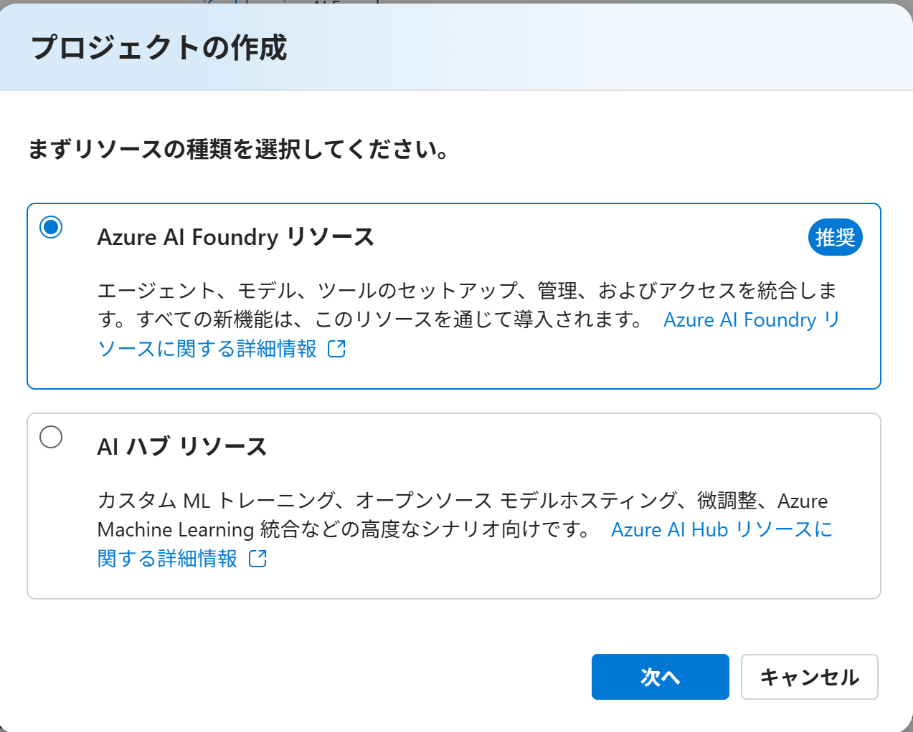
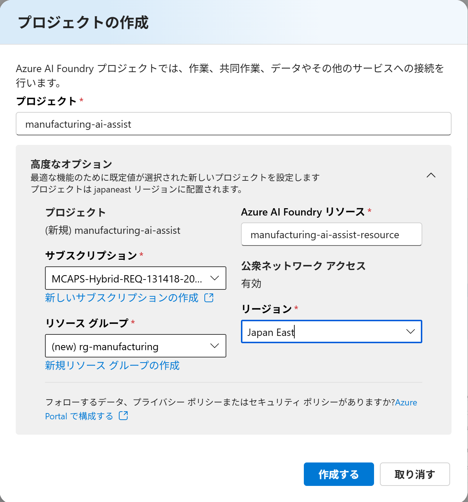
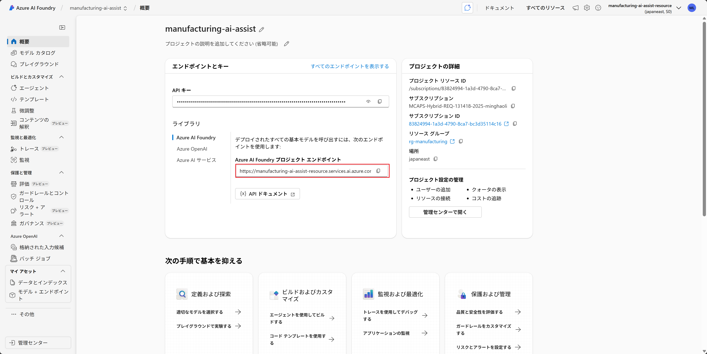

# Module 1: Azure AI Foundry プロジェクト作成

## 目標

Azure AI Foundry で製造業 AI Assistant プロジェクトを作成し、基本的な環境を準備します。

## 所要時間

約5分

---

## 手順

### ステップ 1: Azure AI Foundry へのアクセス

1. ブラウザで https://ai.azure.com にアクセス
2. Azure アカウントでサインイン（組織アカウントまたは個人アカウント）

**確認ポイント**:
- ✅ ホーム画面が表示される
- ✅ 上部に Azure AI Foundry のロゴが表示される

---

### ステップ 2: 新しいプロジェクトの作成

#### 2.1 プロジェクト作成の開始

1. ホーム画面で **「+ 新規作成」** または **「Create new」** をクリック
2. 「Create project」ダイアログが表示される

#### 2.2 
「Azure AI Foundry リソース」を選択すし、「次へ」をクリック

#### 2.3 プロジェクト情報の入力

以下の情報を入力します：

| 項目 | 値 | 説明 |
|------|-----|------|
| **Project name** | `manufacturing-ai-assist` | プロジェクトの識別名 |
| **AI Foundry resource** | `manufacturing-ai-assist-resource` | AI Foundry リソースの識別名 |
| **Subscription** | あなたのサブスクリプション | Azure サブスクリプション |
| **Resource group** | `rg-manufacturing` (新規作成) | リソースグループ名 |
| **Location** | `Japan East` | データセンターの場所 |

#### 2.3 プロジェクトの作成

1. すべての情報を入力後、**「作成する」**  をクリック
2. 作成プロセスが開始される（約1-2分）

---

### ステップ 3: プロジェクトの確認

作成完了後、以下を確認します：

#### 3.1 プロジェクトホーム画面

- ✅ プロジェクト名 `manufacturing-ai-assist` が表示される
- ✅ 左側のナビゲーションメニューが表示される
- ✅ プロジェクト概要が表示される

#### 3.2 利用可能な機能の確認

左側メニューで以下が利用可能であることを確認：

- **プレイグラウンド**: AI モデルのテスト環境
  - チャット 
  - ビデオ 
  - 画像
  - オーディオ 
  - 音声
  - 言語
  - 翻訳ツール
  - アシスタント

- **エージェント**: エージェントの管理
    
- **モデル + エンドポイント**: モデルの管理
  - Model catalog
  - Deployments

---

### ステップ 4: プロジェクト情報の記録

後の作業で必要となるため、以下の情報を記録しておきます。

#### 4.1 必要な情報を記録

以下をテキストファイルやメモ帳に記録：

=== Azure AI Foundry プロジェクト情報 ===

`Azure AI Foundry プロジェクト エンドポイント`: `https://manufacturing-ai-assist-resource.services.ai.azure.com/api/projects/manufacturing-ai-assist`

---

## ✅ チェックリスト

完了したら以下を確認してください：

- [ ] Azure AI Foundry にサインインできた
- [ ] 新しいプロジェクトが作成された
- [ ] プロジェクト名が正しく設定されている
- [ ] プロジェクトのエンドポイント URL を記録した
- [ ] プロジェクト画面にアクセスできる
- [ ] 左側メニューで「エージェント」メニューが表示される

---

## 次のステップ

Module 1 が完了したら、[Module 2: AI Agent の構築](module2-ai-agent.md) に進みましょう。

Module 2 では、Azure AI Foundry を使って製造業専門の AI Agent を作成します。
