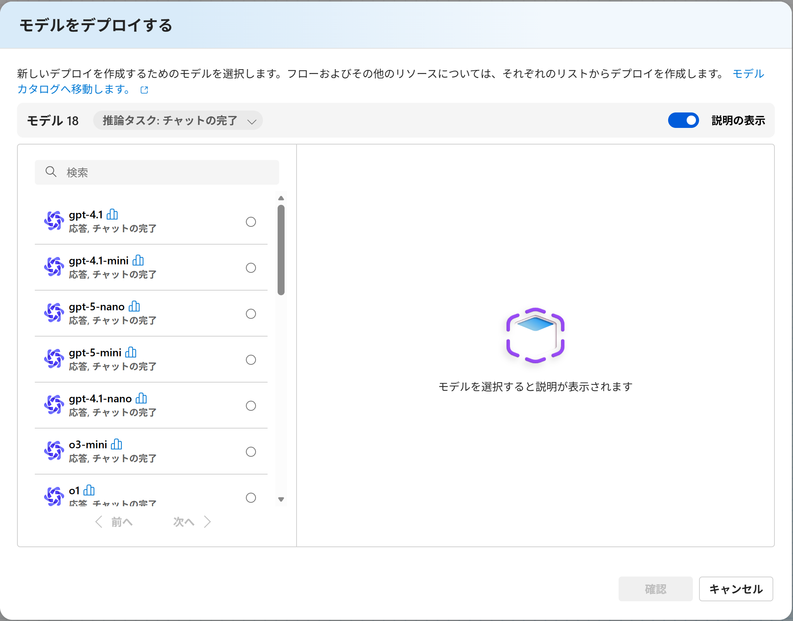
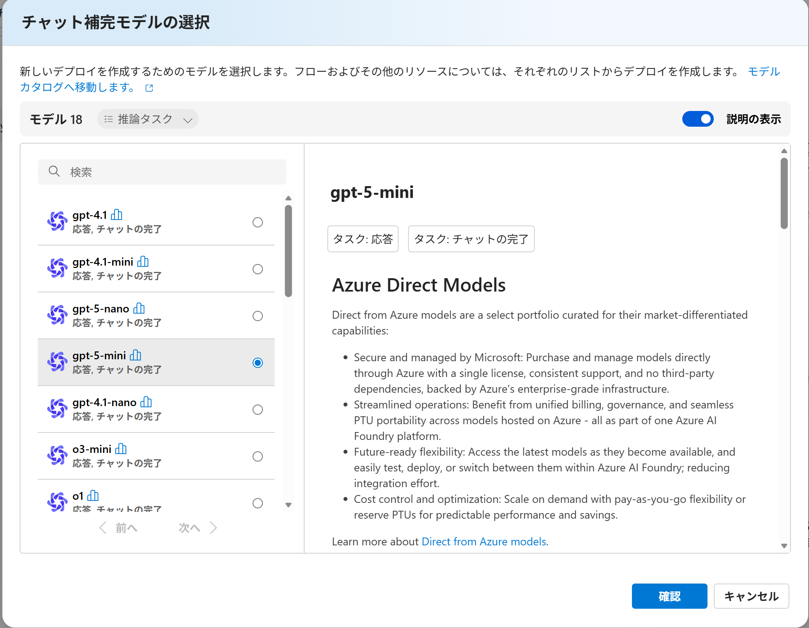
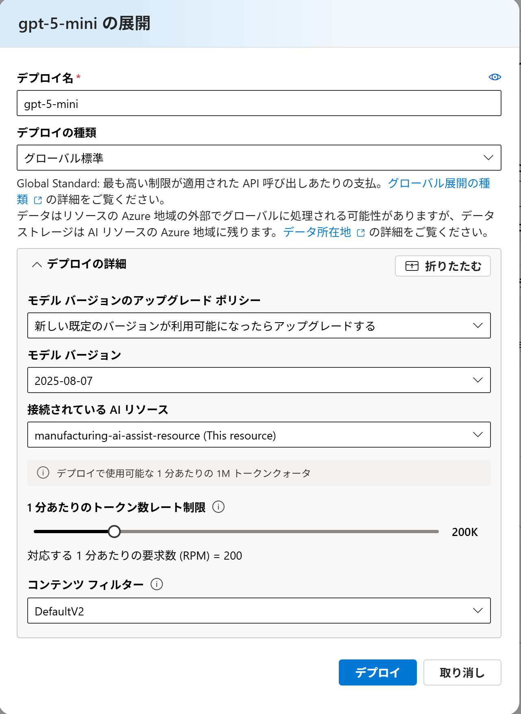
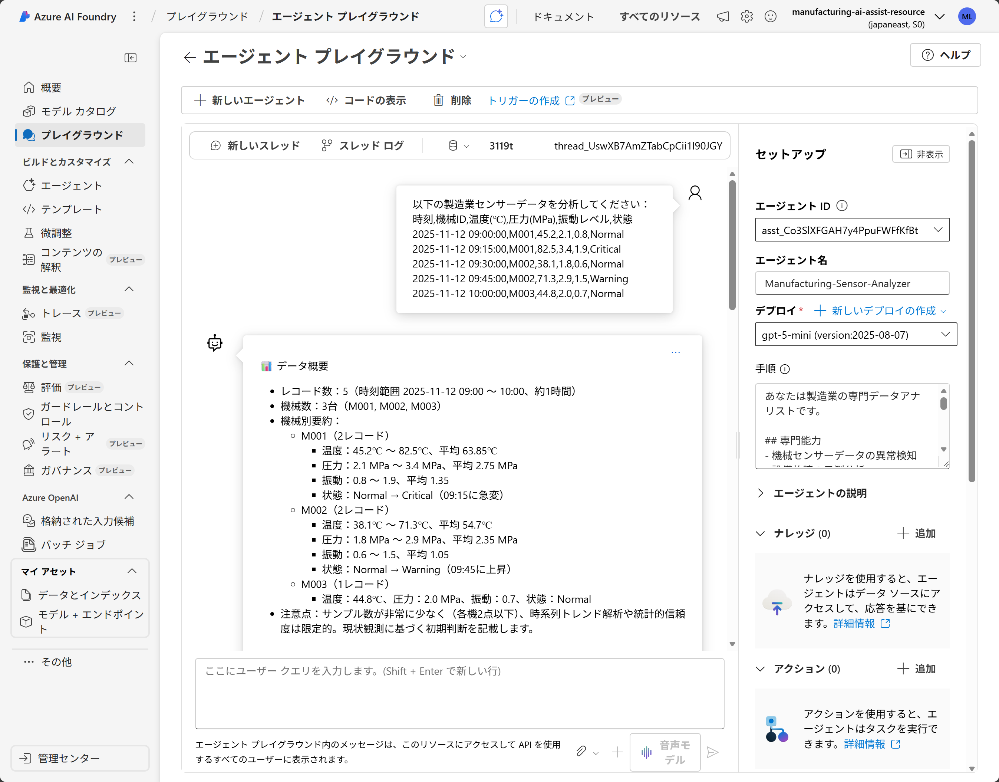

# Module 2: AI Agent の構築

## 目標

Azure AI Foundry で製造業のセンサーデータ分析を専門とする AI Agent を作成し、プレイグラウンドでテストします。

## 所要時間

約 5〜10 分

---

## 手順

### ステップ 1: Agent 作成画面へのアクセス

1. Azure AI Foundry プロジェクト画面で左側メニューから **「Agent」** を選択します。
2. **「+ Create」** または **「+ 作成」** ボタンをクリックします。
3. Agent 作成ダイアログが表示されます。

続いて **「Deploy a model」（モデルをデプロイ）」** ダイアログが開きます。


---

### ステップ 2: AI モデルの選択とデプロイ

#### 2.1 モデルの選択

表示されたモデルカタログから目的に合ったモデルを選択します。

**推奨モデル（学習用途向け）**:

| モデル | 特徴 | パラメータ調整 | 推奨用途 |
|--------|------|----------------|----------|
| **gpt-4o-mini** | 汎用的で高速・低コスト | `temperature`, `top_p` 調整可能 | パラメータ学習、一般的な分析 |
| **gpt-5o-mini** | 推論能力特化型 | `reasoning_effort` のみ | 深い分析、原因推定 |

**各モデルの詳細**:

**gpt-4o-mini**:
- テキストと画像入力に対応 / 関数呼び出し / JSON モード
- `temperature`, `top_p`, `frequency_penalty`, `presence_penalty` が調整可能
- 学習・検証に最適

**gpt-5o-mini**:
- 高度な分析や因果関係の説明が必要なケースに有効
- ⚠️ Reasoning モデルのため、`temperature` などの生成パラメータは**非対応**
- 代替として `reasoning_effort` (low / medium / high) で推論深度を制御

💡 **このラボでは gpt-4o-mini または gpt-5o-mini を選択します。**

💡 **ヒント**: 最新の料金情報を確認し、ニーズに合ったモデルを選択してください：
- [Azure OpenAI Service の料金](https://azure.microsoft.com/en-us/pricing/details/cognitive-services/openai-service/)


#### 2.2 モデルのデプロイ

1. モデルを選択した状態で **「確認」** をクリックします。
2. デプロイ名と種類を入力し、**「デプロイ」** をクリックします。


※必要に応じて、デプロイの詳細をカスタマイズする

⏱️ デプロイと Agent 作成には数秒（目安: 約 5 秒）かかります。

#### 2.3 作成完了の確認

作成が完了すると、Agent の設定画面が表示されます。

---

### ステップ 3: Agent の設定

作成後、設定画面で以下を設定します。

#### 3.1 Agent 名の設定（オプション）

Agent に分かりやすい名前を付けます：

**Agent 名の例**: `Manufacturing-Sensor-Analyzer`

#### 3.2 Instructions（指示）の設定

Agent の動作を定義する Instructions を設定します。

**Instructions セクション** に以下のプロンプトを入力します：

```
あなたは製造業の専門データアナリストです。

## 専門能力
- 機械センサーデータの異常検知
- 設備故障の予測分析
- メンテナンススケジュールの最適化提案

## 分析手順
1. データの基本統計情報を確認
2. 各機械の状態を個別に評価
3. 異常パターンを特定
4. 緊急度に応じた対応優先度を設定
5. 具体的な改善提案を提供

## 出力形式
- 📊 データ概要
- ⚠️ 検出された異常
- 🔧 推奨メンテナンス
- 📈 改善提案

必ず日本語で応答してください。
実用的で具体的なアドバイスを提供してください。
```

※入力後は自動保存されます。必要に応じて下部の保存ボタンで明示的に保存しても構いません。

---

### ステップ 4: Agent のテスト

#### 4.1 テストチャットの開始

1. Agent 設定画面で **「プレイグラウンドで試す」** タブをクリックします。
2. チャット画面が表示されます。

#### 4.2 テストデータの準備

以下のセンサーデータをコピーします：

```
以下の製造業センサーデータを分析してください：
時刻,機械ID,温度(℃),圧力(MPa),振動レベル,状態
2025-11-12 09:00:00,M001,45.2,2.1,0.8,Normal
2025-11-12 09:15:00,M001,82.5,3.4,1.9,Critical
2025-11-12 09:30:00,M002,38.1,1.8,0.6,Normal
2025-11-12 09:45:00,M002,71.3,2.9,1.5,Warning
2025-11-12 10:00:00,M003,44.8,2.0,0.7,Normal
```

#### 4.3 分析の実行

1. チャット入力ボックスにテストデータを貼り付けます。
2. **送信アイコン** をクリックします。
3. AI エージェントの応答を待ちます（数十秒）。

#### 4.4 期待される出力の確認



---

### ステップ 5: Agent ID の取得と記録

Agent ID は次モジュール（Module 3）で Web アプリから呼び出す際に必要です。

取得方法:
1. 左メニューの **「エージェント」** を開くと一覧に **ID** 列が表示されます（スクリーンショット参照）。
2. 目的のエージェント行の ID をコピーします。行をクリックすると右側セットアップパネルにも **「エージェント ID」** が表示され、同じ値をコピーできます。

記録例:
```
Agent ID: asst_xxxxxxxxxxxxxxxxxxxxx
```

注意:
- エージェントを再作成すると ID は変わります。再取得を忘れないでください。
- 公開リポジトリには直接書かないでください。
- 後続モジュールで API クライアント初期化時にこの ID を使用します。

---

### ステップ 6: パラメータの調整（オプション）

利用するモデルによって調整可能な項目が異なります。

#### 6.1 gpt-4o-mini 使用時（生成調整可能）
| パラメータ | 推奨値 | 説明 |
|-----------|--------|------|
| **temperature** | 0.3 | 低い値: 再現性向上 / 高い値: 創造性増加 |
| **top_p** | 0.9 | Nucleus sampling で上位確率集合を制限 |

推奨プリセット:
```
temperature: 0.3   # 正確性・安定性重視
top_p: 0.9
```

---

## ✅ チェックリスト

完了したら以下を確認してください：

- [ ] Agent が正常に作成された
- [ ] モデル (gpt-4o-mini または gpt-5o-mini) を選択した
- [ ] Instructions を設定して保存した
- [ ] パラメータ (temperature または reasoning_effort) を設定した
- [ ] Agent ID をコピーして記録した
- [ ] プレイグラウンドでテストデータを使って動作確認できた
- [ ] AI が日本語で分析結果を返した

---

## 次のステップ

Module 2 が完了したら、[Module 3: Web アプリケーション統合](module3-webapp.md) に進みましょう。

Module 3 では、事前に準備された Blazor Web アプリケーション テンプレートを使用し、Azure Container Apps にデプロイして Agent を実行します。