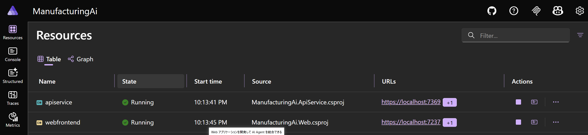
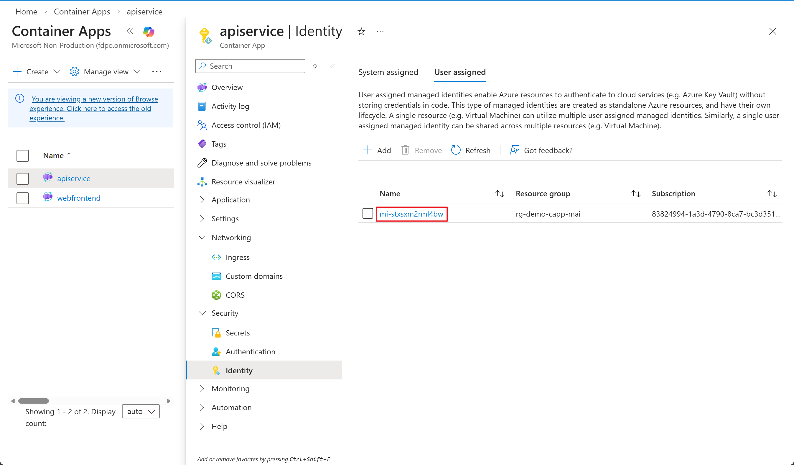
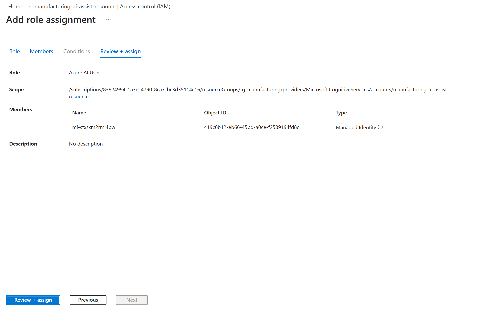
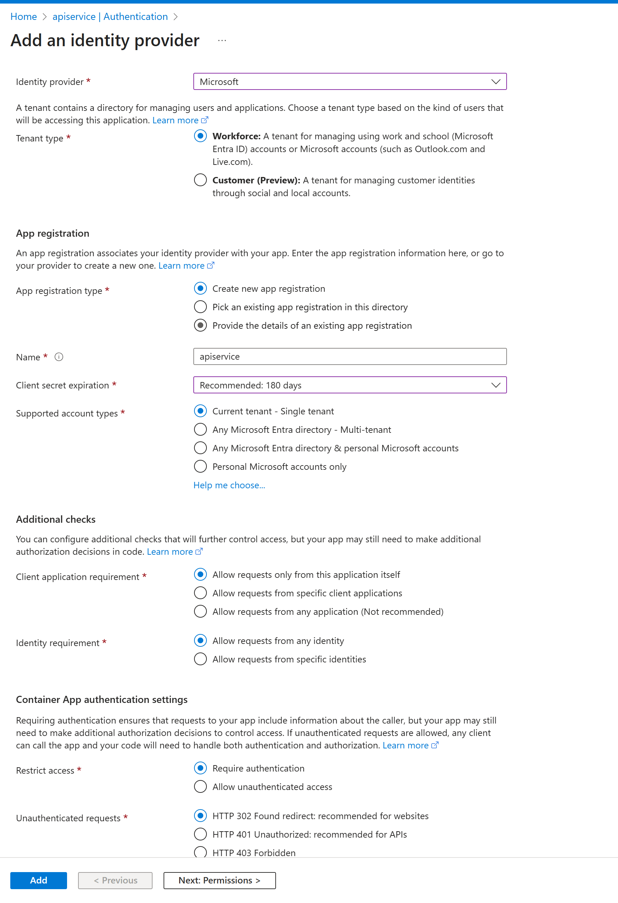

# Module 3: Web アプリ & API 統合 / デプロイ

## 目標

Module 2 で作成した Azure AI Agent を既存の .NET サンプル (`samples/sensor-data-insight-agent-sample`) に統合し、ローカル実行 → Azure Container Apps へデプロイする手順を習得します。

## 所要時間

約 30〜45 分

---

## アーキテクチャ概要 (.NET Aspire)

```
┌───────────────────────────┐      ┌─────────────────────────┐
│ ManufacturingAi.Web       │────→ │ ManufacturingAi.ApiService│
│ (Blazor Server)           │ HTTP │ (Minimal API + Agent統合) │
└──────────────┬────────────┘      └──────────────┬───────────┘
               │ Service Discovery (.NET Aspire)   │ Azure SDK
               ▼                                    ▼
          ┌─────────────┐                   ┌────────────────────┐
          │ AppHost      │                   │ Azure AI Foundry    │
          │ (Aspire Orch)│                   │ Persistent Agent API │
          └─────────────┘                   └────────────────────┘
```

---

## 前提条件 (Prerequisites)

- .NET 10 以降 SDK / Visual Studio 2022 17.10+ 
- Azure サブスクリプション (リソースグループ作成済み推奨)
- Module 2 で取得した: `AgentId`, プロジェクトのエンドポイント URL (例: `https://<project>.services.ai.azure.com/api/projects/<project-name>`) 

---

## ステップ 1: サンプルコードの取得

方法 A: 既にリポジトリを clone 済みの場合 → この手順は不要。

方法 B: 初回取得:
```powershell
cd C:\work\blogs\azure-ai-from-zero-to-hero
# 既に clone 済みならスキップ。GitHub から ZIP ダウンロードでも可。
# git clone <YOUR_FORK_URL> .  (フォークを使う場合)
```

サンプルパス:
```
samples\sensor-data-insight-agent-sample\src\ManufacturingAi.slnx
```

---

## ステップ 2: 設定ファイルの編集 (Agent 情報の反映)

1. フォルダを開く: `samples/sensor-data-insight-agent-sample/src/ManufacturingAi.ApiService/`
2. `appsettings.json` を開いて、以下の 2 つの値を Module 2 で記録した値に置き換えます:

```jsonc
{
  "AiFoundry": {
    "EndPointUrl": "https://YOUR-PROJECT.services.ai.azure.com/api/projects/YOUR-PROJECT", // プロジェクト URL
    "AgentId": "asst_xxxxxxxxxxxxxxxxxxxxx"                                             // Agent ID
  }
}
```

3. セキュリティ運用では `appsettings.json` ではなく環境変数を利用推奨:
   - PowerShell ローカル起動例:
     ```powershell
     $env:AiFoundry__EndPointUrl="https://..."
     $env:AiFoundry__AgentId="asst_xxxx"
     ```

---

## ステップ 3: ローカル実行 (Visual Studio / 個別)

### 3.1 Visual Studio で実行 (最も簡単)
1. `samples/sensor-data-insight-agent-sample/src/ManufacturingAi.slnx` を Visual Studio で開く
2. 既定のスタートアップは `.AppHost` (Aspire) になっているはず。もし違う場合は `ManufacturingAi.AppHost` を右クリック → 「スタートアップ プロジェクトに設定」
3. `F5` (デバッグ) もしくは `Ctrl+F5` (デバッグなし) を押下
4. 自動的に Aspire ダッシュボードがブラウザに表示され、`Web` と `ApiService` が起動


トラブル時:
```powershell
dotnet dev-certs https --trust   # HTTPS 証明書問題がある場合
```

### 3.2 個別起動 (学習・デバッグ用)
API のみ / Web のみを個別に動かして挙動を学ぶ場合:

API:
```powershell
cd samples/sensor-data-insight-agent-sample/src/ManufacturingAi.ApiService
dotnet run
```
次のStepに使うので、起動した後に、ApiServiceのURLを記録する、例:　`"http://localhost:5308"`
Web (API 直 URL 指定環境変数利用):
```powershell
cd samples/sensor-data-insight-agent-sample/src/ManufacturingAi.Web
$env:APISERVICE_URL="http://localhost:5308"; dotnet run
```

学習ポイント:
- 個別起動ではサービスディスカバリ (`apiservice`) 名解決が使えないため `APISERVICE_URL` を明示
- Aspire 統合との差異を確認し、ポリシー / リトライ設定の動作を観察可能

---

## ステップ 4: 動作確認 (ローカル)

1. ブラウザで Web (Blazor) を開く
2. センサーデータ例を貼り付け:
   ```csv
   時刻,機械ID,温度(℃),圧力(MPa),振動レベル,状態
   2025-11-12 09:00:00,M001,45.2,2.1,0.8,Normal
   2025-11-12 09:15:00,M001,82.5,3.4,1.9,Critical
   2025-11-12 09:30:00,M002,38.1,1.8,0.6,Normal
   ```
3. 「分析」または送信操作を実行
4. 応答に: データ概要 / 異常検知 / 推奨メンテナンス が日本語で表示される

---

## ステップ 5: デプロイ & Portal で環境変数設定 (推奨フロー)

Visual Studio の Publish 画面に環境変数タブが無い場合があるため、まず発行→その後 Azure Portal で設定する手順を標準フローとします。

### 5.1 Publish (環境変数無しで構わない)
1. Visual Studio で `ManufacturingAi.slnx` を開く
2. ソリューション エクスプローラーで `ManufacturingAi.AppHost` を右クリック → 「公開 (Publish)」
3. ターゲット: Azure → **Container Apps** → 次へ
4. サブスクリプション / リソースグループ / Container Apps Environment を選択 (初回は自動作成でも可)
5. 「Publish」 をクリックし完了まで待機
6. Output に成功ログ & 公開 URL が表示されることを確認

### 5.2 Azure Portal で環境変数を設定

#### 5.2.1 Container App を開く

1. **Azure Portal にアクセス**: [https://portal.azure.com](https://portal.azure.com)
2. **検索バーで Container App を検索**:
   - 検索ワード: `manufacturing` または デプロイ時に指定した名前
   - API サービスの Container App をクリック (例: `manufacturing-ai-apiservice`)

#### 5.2.2 環境変数を追加

1. **左メニューから「設定」セクションを展開**
2. **「環境変数」** をクリック
3. **「+ 追加」** ボタンをクリック
4. **以下の 2 つの環境変数を追加**:

| 名前 | 値 | 説明 |
|------|-----|------|
| `AiFoundry__EndPointUrl` | `https://aif-xxx.services.ai.azure.com/api/projects/pj-xxx` | Module 1 で記録した Project URL |
| `AiFoundry__AgentId` | `asst_xxxxxxxxxxxxxxxxxx` | Module 2 で記録した Agent ID |

**入力例**:
```
名前: AiFoundry__EndPointUrl
値: https://manufacturing-ai-assist-resource.services.ai.azure.com/api/projects/manufacturing-ai-assist

名前: AiFoundry__AgentId
値: asst_abc123def456ghi789jkl012
```

5. **「適用」** をクリック
6. **新しいリビジョンが自動作成される**のを待つ (約 30 秒〜1 分)

💡 **Tips**: 
- リビジョン一覧で「アクティブ」になっていることを確認してください
- 環境変数は大文字小文字を区別します（`__` は 2 つのアンダースコア）

#### 5.2.3 動作確認

1. **API の Health エンドポイントにアクセス**:
   - Container App の「概要」タブで「アプリケーション URL」をコピー
   - ブラウザで `https://<your-api-url>/health` を開く

2. **期待される応答**:
```json
{
  "status": "Healthy",
  "totalDuration": "00:00:00.0123456"
}
```

⚠️ **トラブルシューティング**:
- `Unhealthy` が表示される場合: 環境変数の値を再確認
- 500 エラーの場合: ログストリームで詳細を確認

これで Visual Studio 経由のデプロイ手順は完了です。

---

## ステップ 6: Managed Identity に権限を付与

Container Apps にデプロイすると、自動的に **User-assigned Managed Identity** が作成されます。この Managed Identity に Azure AI Foundry へのアクセス権限を付与する必要があります。

### 6.1 Managed Identity の確認

1. **Azure Portal で API の Container App を開く**
2. **左メニュー → 「設定」 → 「ID」** をクリック
3. **「ユーザー割り当て済み」** タブで、自動作成された Managed Identity が一覧に表示されていることを確認
4. Managed Identity の名前をクリックして詳細を開く
5. **オブジェクト (プリンシパル) ID** をコピーしてメモ (例: `mi-stxsxm2rml4bw`)



💡 **Tips**: Visual Studio からのデプロイ時に自動的に User-assigned Managed Identity が作成され、Container App に割り当てられます。

### 6.2 Azure AI Foundry プロジェクトに権限を付与

1. **Azure Portal で Azure AI Foundry プロジェクトを開く**:
   - 検索バーで Module 1 で作成したプロジェクト名を検索 (例: `manufacturing-ai-assist`)
   - リソースの種類が **「AI project」** であることを確認

2. **左メニュー → 「アクセス制御 (IAM)」** をクリック

3. **「+ 追加」 → 「ロールの割り当ての追加」** を選択

4. **ロールを選択**:
   - 「ロール」タブで **「Azure AI User** を検索して選択
   - **「次へ」** をクリック

5. **メンバーを追加**:
   - **「アクセスの割り当て先」**: 「マネージド ID」を選択
   - **「+ メンバーの選択」** をクリック
   - **「マネージド ID」**: 「ユーザー割り当てマネージド ID」を選択
   - 一覧から自動作成された Managed Identity を選択 
   - **「選択」** をクリック

6. **「レビューと割り当て」** を 2 回クリックして完了



### 6.3 権限付与の確認

1. **Azure Portal で AI Foundry プロジェクトの「アクセス制御 (IAM)」** を開く
2. **「ロールの割り当て」** タブをクリック
3. **「Azure AI Developer」** ロールを展開
4. Container App の Managed Identity が表示されていることを確認

⚠️ **重要**: 
- 権限が反映されるまで **1〜2 分**かかる場合があります
- 権限付与後、Container App を再起動する必要はありませんが、即反映させるため、再起動することがお勧め。

---

## ステップ 7: デプロイ後検証

1. **権限が反映されたことを確認**:
   - 権限付与から 1〜2 分待機
   
2. **API の `/health` エンドポイントをブラウザまたは curl で確認**:
   ```powershell
   curl https://<API-APP-URL>/health
   ```
   期待される応答: `{"status":"Healthy"}`

3. **Web の公開 URL にアクセスしてセンサーデータを投入**:
   - Container App の「概要」から Web の URL を取得
   - ブラウザでアクセスし、テストデータを貼り付けて分析実行

4. **AI からの応答を確認**:
   - データ概要、異常検知、推奨メンテナンスが日本語で表示されることを確認

5. **トラブルシューティング**:
   - 応答遅延が長い場合は Azure ポータルで Container Apps のログを確認
   - 認証エラーが出る場合は、ステップ 6 の権限付与を再確認

---

## ステップ 8 (オプション): 組み込み認証でアプリを保護

Container Apps の組み込み認証機能 (Easy Auth) を有効化することで、Azure Entra ID (旧 Azure AD) を使用してアプリケーションへのアクセスを制限できます。

### 8.1 Web アプリに認証を追加

1. **Azure Portal で Web の Container App （webfrontend） を開く**

2. **左メニュー → 「設定」 → 「認証」** をクリック

3. **「ID プロバイダーの追加」** をクリック

4. **認証設定を構成**:
   - **ID プロバイダー**: 「Microsoft」を選択
   - **テナントの種類**: 「従業員」(組織内ユーザー) または 「顧客」(外部ユーザー) を選択
   - **アプリ登録の種類**: 「新しいアプリ登録を作成する」を選択
   - **名前**: `manufacturing-ai-web-auth` (任意の識別可能な名前)
   - **サポートされているアカウントの種類**: 
     - 組織内のみ: 「この組織ディレクトリのみ」
     - 複数組織: 「任意の Azure AD ディレクトリ - マルチテナント」

5. **アクセス制限の設定**:
   - **認証されていない要求**: 「HTTP 302 リダイレクト: ログインページへ」を選択
   - これにより、未認証ユーザーは自動的にログインページにリダイレクトされます

6. **「追加」** をクリックして完了



### 8.2 認証動作の確認

1. **ブラウザで Web の公開 URL にアクセス**

2. **Microsoft ログイン画面が表示されることを確認**:
   - Azure Entra ID の資格情報でサインイン
   - 初回アクセス時はアプリケーションへのアクセス許可を求められる場合があります

3. **サインイン後、アプリケーションにアクセスできることを確認**

---

## トラブルシューティング

| 症状 | 原因候補 | 対処 |
|------|----------|------|
| 404 エラー | API Base URL 未設定 | `APISERVICE_URL` / Aspire 統合確認 |
| Run 失敗/タイムアウト | Agent ID/Endpoint 誤り | `/health` で構成確認・値再設定 |
| 認証エラー (401/403) | Managed Identity の権限不足 | ステップ 6 で Azure AI Developer ロール付与を確認 |
| 応答が空 | データ未送信 or 初回メッセージに RawData 不在 | 最初の送信時にセンサーデータを含める |
| 429 / Rate Limit | 高頻度リクエスト | インターバル調整 / リトライ回数削減 |
| SSL エラー | 開発証明書問題 | `dotnet dev-certs https --trust` 実行 |

ログ確認 (Container Apps):
```powershell
az containerapp logs show --name sensor-ai-api --resource-group <RG> --follow
```

---

## ステップ 9: クリーンアップ (Cleanup)
不要になった学習環境を削除:
```powershell
az containerapp delete --name sensor-ai-api --resource-group <RG> -y
az containerapp delete --name sensor-ai-web --resource-group <RG> -y
```

---

## ベストプラクティス要約
- 機密値は環境変数 / Key Vault 管理
- 初回メッセージのみ RawData を送信しトークン削減
- Polly リトライは回数過多を避け 5 回以内 + 適正タイムアウト
- セッション肥大化時は古い Thread を破棄する設計も検討

---

