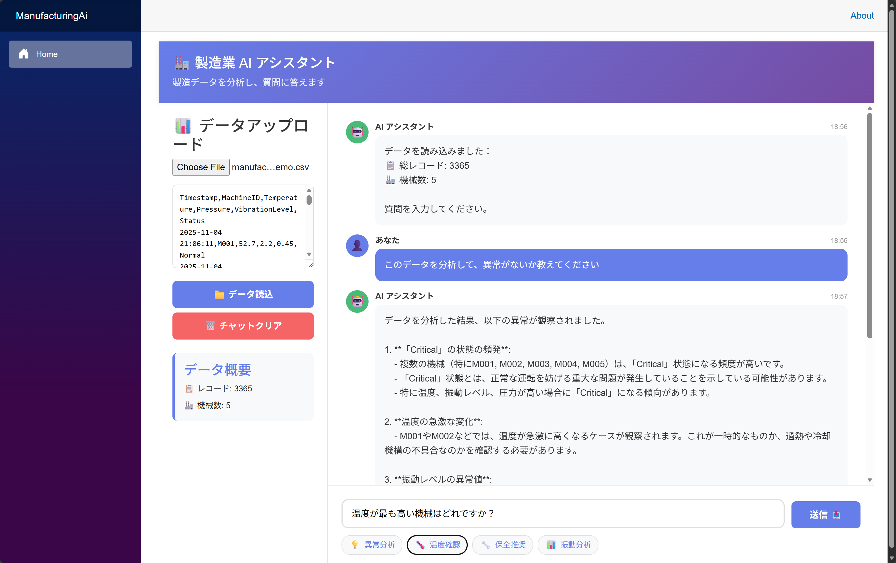

# 製造業センサーデータ分析 AI エージェント

Azure AI Agent を使用した製造業向けセンサーデータ分析サンプルアプリケーション。CSV 形式の製造データをアップロードし、AI エージェントと対話的に分析できます。

## 📋 概要

このサンプルは、.NET Aspire を使用したマイクロサービスアーキテクチャで構築されており、以下の機能を提供します：

- **CSV データアップロード**: 製造機械からのセンサーデータ（温度、圧力、振動レベル）を読み込み
- **AI による分析**: Azure AI Agent を使用してデータを分析し、日本語で質問に回答
- **セッション管理**: 会話履歴を保持し、コンテキストを維持した対話を実現
- **Blazor UI**: インタラクティブな Web インターフェース

## 実行プレビュー



## 🏗️ アーキテクチャ

このプロジェクトは .NET Aspire ベースの 3 層構造：

```
┌─────────────────────────────────────────────────────┐
│  ManufacturingAi.Web (Blazor Server)               │
│  - CSV データパーサー                                │
│  - チャット UI                                       │
│  - API クライアント (Polly リトライ付き)              │
└─────────────────┬───────────────────────────────────┘
                  │ HTTP/HTTPS
┌─────────────────▼───────────────────────────────────┐
│  ManufacturingAi.ApiService (Minimal API)          │
│  - Azure AI Agents 統合                             │
│  - セッション/スレッド管理                            │
│  - AgentService (シングルトン)                       │
└─────────────────┬───────────────────────────────────┘
                  │ Azure SDK
┌─────────────────▼───────────────────────────────────┐
│  Azure AI Foundry                                  │
│  - Persistent Agents API                           │
│  - Managed Identity 認証                            │
└─────────────────────────────────────────────────────┘
```

### プロジェクト構成

- **ManufacturingAi.Web**: Blazor Server フロントエンド
  - CSV パーサー (`SensorParser`)
  - API クライアント (`AnalyzeAiClient`) - Polly による回復性機能
  - インタラクティブな UI コンポーネント

- **ManufacturingAi.ApiService**: バックエンド API
  - Azure AI Agents 統合
  - セッション管理 (`AgentService`)
  - スレッドとメッセージの永続化

- **ManufacturingAi.AppHost**: .NET Aspire オーケストレーター
  - サービスディスカバリ
  - ヘルスチェック
  - ローカル開発環境の構成

- **ManufacturingAi.ServiceDefaults**: 共通サービス拡張
  - テレメトリ
  - ヘルスチェック
  - サービスディスカバリ設定

## 🔑 主要機能

### 1. **セッション管理とスレッド永続化**
- セッション ID ごとに Azure AI スレッドを管理
- データが変更された場合は新しいスレッドを自動作成
- メモリキャッシュによる高速なセッション取得

### 2. **データコンテキストの最適化**
- 初回メッセージ時のみ生データを送信
- 以降はクエリのみを送信してトークン消費を削減
- データハッシュによる変更検出

### 3. **回復性とエラー処理**
- Polly による自動リトライ（最大 5 回）
- サーキットブレーカーパターン
- タイムアウト管理（1 分）
- 500 エラーと `TimeoutRejectedException` のハンドリング

### 4. **Azure AI Agents 統合**
- `Azure.AI.Agents.Persistent` SDK 使用
- `DefaultAzureCredential` による認証（Managed Identity サポート）
- 非同期メッセージ処理とポーリング

## 📦 必要な NuGet パッケージ

### ApiService
```xml
<PackageReference Include="Azure.AI.Agents.Persistent" Version="1.1.0" />
<PackageReference Include="Azure.AI.Projects" Version="1.1.0" />
<PackageReference Include="Azure.Identity" Version="1.17.0" />
```

### Web
```xml
<PackageReference Include="CsvHelper" Version="33.1.0" />
```

## ⚙️ セットアップ

### 前提条件

- .NET 10.0 SDK
- Visual Studio 2022/Visual Studio 2026 または VS Code
- Azure サブスクリプション
- Azure AI Foundry プロジェクト

### Azure AI Foundry の準備

1. Azure AI Foundry でプロジェクトを作成
2. AI Agent を作成してエージェント ID を取得
3. プロジェクトエンドポイント URL を確認

### 設定ファイルの構成

`ManufacturingAi.ApiService/appsettings.json` を編集：

```json
{
  "AiFoundry": {
    "EndPointUrl": "https://your-ai-foundry.services.ai.azure.com/api/projects/your-project",
    "AgentId": "asst_xxxxxxxxxxxxxxxxxxxxxxxx"
  }
}
```

**⚠️ 注意**: `appsettings.json` には実際の値を含めないでください。環境変数または Azure Key Vault を使用してください。

### ローカル実行

#### .NET Aspire を使用（推奨）

```powershell
cd ManufacturingAi.AppHost
dotnet run
```

Aspire ダッシュボードが開き、すべてのサービスを管理できます。

#### スタンドアロン実行

API サービス:
```powershell
cd ManufacturingAi.ApiService
dotnet run
```

Web フロントエンド:
```powershell
cd ManufacturingAi.Web
$env:APISERVICE_URL="https://localhost:7001"; dotnet run
```

## 🚀 使用方法

1. **データのアップロード**
   - CSV ファイルをアップロードするか、テキストボックスに直接貼り付け
   - 形式: `時刻,機械ID,温度(℃),圧力(MPa),振動レベル,状態`
   - 例:
     ```csv
     2025-11-12 09:00:00,M001,45.2,2.1,0.8,Normal
     2025-11-12 09:05:00,M001,46.1,2.3,0.9,Normal
     ```

2. **AI に質問**
   - サンプルプロンプトをクリックまたはカスタムクエリを入力
   - AI エージェントが日本語で分析結果を返答

3. **セッション管理**
   - チャット履歴はセッション内で保持されます
   - "チャットクリア" ボタンで新しいセッションを開始

## 📊 サンプルデータ形式

```csv
時刻,機械ID,温度(℃),圧力(MPa),振動レベル,状態
2025-11-12 09:00:00,M001,45.2,2.1,0.8,Normal
2025-11-12 09:05:00,M001,46.1,2.3,0.9,Normal
2025-11-12 09:00:00,M002,52.3,2.5,1.2,Warning
```

## 🔧 カスタマイズポイント

### タイムアウト設定
`ManufacturingAi.Web/Program.cs` でリトライとタイムアウトを調整：

```csharp
options.AttemptTimeout.Timeout = TimeSpan.FromMinutes(1);
options.TotalRequestTimeout.Timeout = TimeSpan.FromMinutes(3);
```

### エージェントプロンプト
Azure AI Foundry でエージェントの指示（System Prompt）をカスタマイズして、業界固有の分析を実現。

### セッションタイムアウト
`AgentService` にセッション有効期限管理を追加可能。

## 🌐 Azure へのデプロイ

### Azure Container Apps へのデプロイ

```powershell
cd ManufacturingAi.AppHost
azd init
azd up
```

.NET Aspire が自動的に Azure リソースをプロビジョニングします：
- Azure Container Apps
- Azure Container Registry
- Application Insights
- Managed Identity の設定

### 環境変数の設定

デプロイ後、Azure Portal で以下を設定：

- `AiFoundry__EndPointUrl`: Azure AI Foundry エンドポイント
- `AiFoundry__AgentId`: エージェント ID

## 🔒 セキュリティのベストプラクティス

- ✅ Managed Identity を使用した認証
- ✅ API キーを `appsettings.json` にコミットしない
- ✅ Azure Key Vault でシークレットを管理
- ✅ 環境変数または User Secrets を使用
- ✅ HTTPS の強制
- ✅ CORS ポリシーの適切な設定

## 📝 注意事項

- このサンプルはデモ用途です。本番環境では追加のセキュリティとエラー処理が必要です
- Azure AI Agents API の使用には課金が発生します
- セッションはメモリキャッシュに保存されるため、アプリ再起動で失われます
- 大容量 CSV (>10MB) は制限されています

## 🛠️ トラブルシューティング

### "Agent not configured" エラー
- `appsettings.json` で `EndPointUrl` と `AgentId` が正しく設定されているか確認
- `/health` エンドポイントでステータスを確認

### タイムアウトエラー
- Azure AI Foundry のエージェント応答時間を確認
- Polly のタイムアウト設定を延長

### サービスディスカバリエラー
- Aspire ダッシュボードでサービスの状態を確認
- `apiservice` の名前解決が正しく機能しているか確認

## 📚 参考リンク

- [Azure AI Foundry Documentation](https://learn.microsoft.com/azure/ai-studio/)
- [.NET Aspire Documentation](https://learn.microsoft.com/dotnet/aspire/)
- [Azure AI Agents SDK](https://learn.microsoft.com/dotnet/api/overview/azure/ai.agents.persistent-readme)
- [Polly Resilience Library](https://www.pollydocs.org/)

## 📄 ライセンス

このサンプルコードは学習目的で提供されています。
